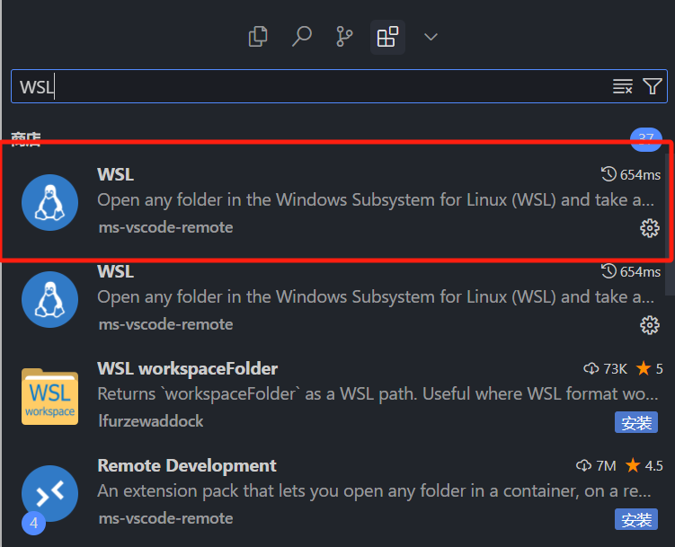
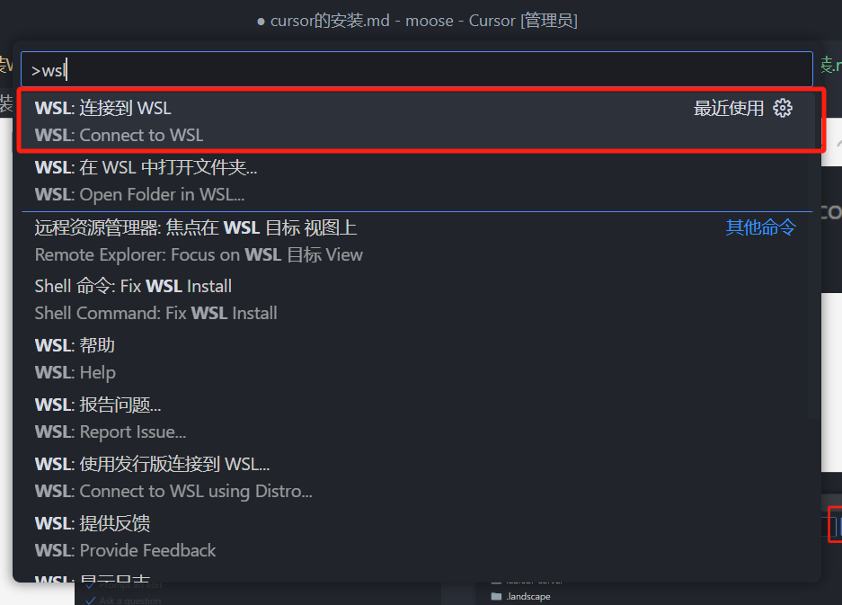
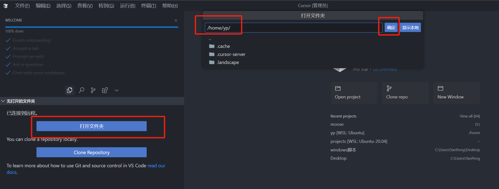
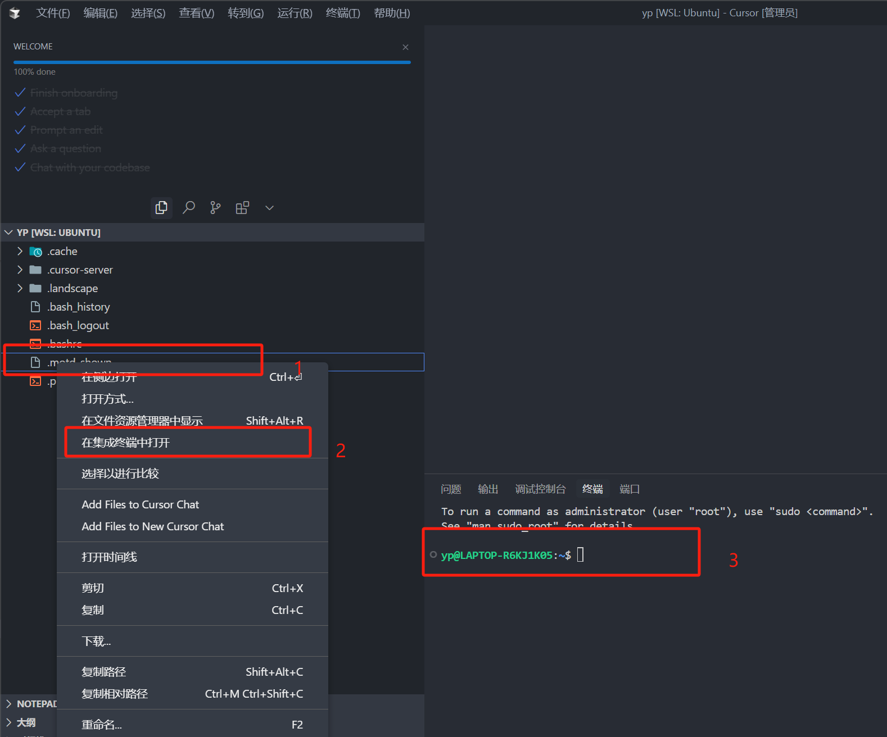
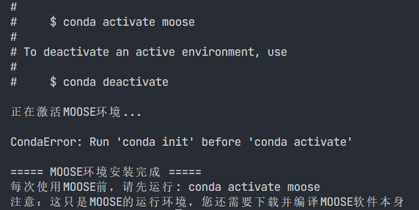
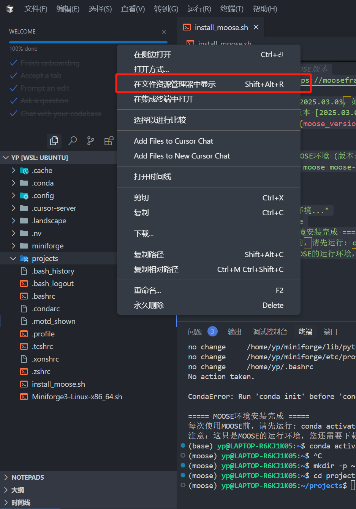
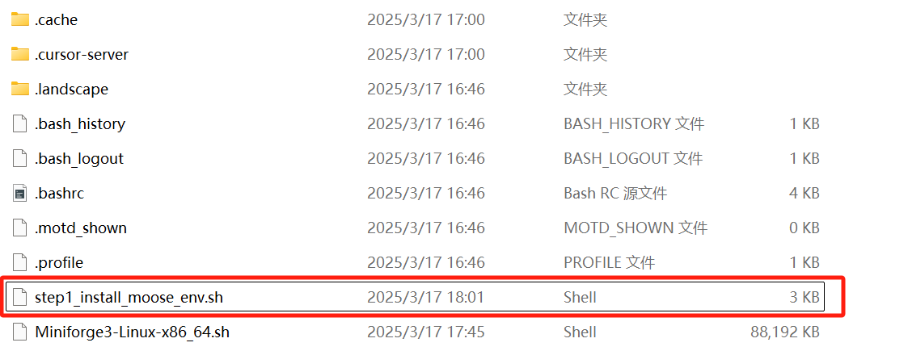
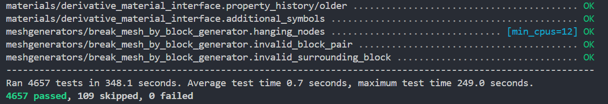

# FuelRods

我的中文版零基础moose教程，热力耦合的燃料芯块模拟。

# 第一章，安装

## 第一步：安装WSL

（用终端脚本下载步骤b)的文件太慢了，这里没有做脚本）
一开始没有安装window的子系统linux（WSL）前，先不需要将fuel_rods的全部代码clone下来，只需要看着下面教程一步步来即可，**如果是新手，请别想着跳步！千万别着跳步！千万别跳步！**

a)       [启用window子系统及虚拟化](https://blog.csdn.net/u011119817/article/details/130745551#1window_14)

    windows终端power shell输入（快捷键：win+X，再按A，即可打开终端power shell）：

    **《Enable-WindowsOptionalFeature -Online -FeatureName Microsoft-Windows-Subsystem-Linux》**

    先别重启！

    **《Enable-WindowsOptionalFeature -Online -FeatureName VirtualMachinePlatform》**

    开启完这两个后，电脑需要重启

b)      [下载发行版本](https://aka.ms/wslubuntu2004)**，不能跳过这一步！！！**

c)      [更新WSL2前置]
    windows终端power shell输入：

    《**wsl --update**》

    《**wsl --set-default-version 2**》

d)      [安装linux子系统]
    双击安装中下好的子系统，设置linux系统名字与密码，然后就安好linux子系统。

    注意：输入密码时并不会显示你输入了什么，密码注意别太麻烦，设置一个字符都可以

## 第二步：安装Cursor

安装Cursor等*代码集成开发环境*可以更加方便的安装与运行moose，直接去官网安装最新版的Cursor：

[点击下载Cursor - The AI Code Editor，](https://www.cursor.com/cn)

如何使用Cursor打开子系统WSL？

1. 打开任意一个文件夹，在左边选择中下载这么一个插件wsl

2. 然后安装好后，按顺序同时按住shift+ctrl+p键呼出命令面板，输入wsl，选择连接到wsl，等待一会

3. 并在左侧选择/home/xx/即可(xx是你的linux系统名字)，如下图所示

到此，linux系统与相关配套的cursor安装好了！！！

## 第三步：安装MOOSE环境

回到Cursor在左端右键任意一个文件，选择在集成终端打开，出现3号红色矩形的内容，这个

**《在集成终端打开》功能是非常非常非常好用的功能，请务必记住**

下载一键安装moose环境与moose本体的脚本：

一键安装**moose环境**脚本下载（step1_install_moose_env.sh）：
    
    curl -L -O https://github.com/MissCat-2025/fuel_rods/blob/main/tutorial/scripts/step1_install_moose_env.sh

一键安装**moose本体**脚本下载（step2_install_moose_software.sh）：
    
    curl -L -O https://github.com/MissCat-2025/fuel_rods/blob/main/tutorial/scripts/step2_install_moose_software.sh

把两个脚本下载好后，后面的一切就变得简单起来

    回到Cursor，在左端右键脚本文件，选择在集成终端打开，在cursor显示的终端按理说如下图：

后运行如下代码即可：
赋予step1_install_moose_env.sh运行权限：

    chmod +x step1_install_moose_env.sh

运行step1_install_moose_env.sh脚本：

    ./step1_install_moose_env.sh

出现下图所示的结果就安装好了moose环境

如果环境安装失败,那么**极大概率是没有将脚本1中涉及的Miniforge3-Linux-x86_64.sh下载好**，它的大小一般是91671kb
检查\\wsl.localhost\Ubuntu\home\yp目录下是否有Miniforge3-Linux-x86_64.sh文件且大小与它是否差不多，若小太多，那么就重新运行这个脚本以下载它。
下载实在慢就手动下载(将下面的链接复制到浏览器的地址栏)：

    https://github.com/conda-forge/miniforge/releases/latest/download/Miniforge3-Linux-x86_64.sh

并将该文件放入/home/xx/，方法如下图：

将你下载的文件复制黏贴放到下面的位置即可(红色圈圈下面的文件就是咱们需要的Miniforge3-Linux-x86_64.sh)

## 第四步：安装MOOSE本体

回到Cursor在左端右键脚本文件，选择在集成终端打开，在cursor显示的终端按理说如下图：

在该终端运行如下代码即可

赋予step2_install_moose_software.sh运行权限：

    chmod +x step2_install_moose_software.sh

运行step2_install_moose_software.sh脚本：

    ./step2_install_moose_software.sh

注意，如果编译失败，就重新运行脚本并将核数减小。耐心等一段时间，看到

的类似的结果就可以放心了，这下moose就完全安装好了，没安好就把moose整个文件夹删掉，然后重复该脚本

# 接下来的MOOSE具体教程请看fuel_rods/tutorial/MooseTutorial1.0.docx
